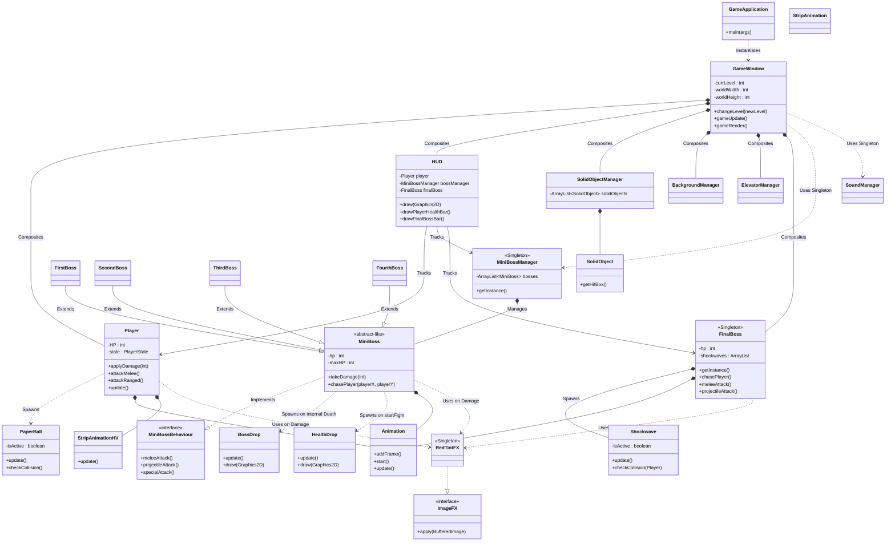

# GameProject Object-Oriented Class Diagram

Below is a generated UML representation of the core objects, interactions, and inheritance relationships that power your campus climber video game.

### Design Notes:
* **Singleton Patterrns:** Utility classes that only run once per application stream (like `ImageManager`, `MiniBossManager`, `FinalBoss`, and `RedTintFX`) are built as strictly encapsulated singletons.
* **Component Encapsulation:** Systems like the `SolidObjectManager` map geometric terrain and aggregate instances of `SolidObject` safely away from the player classes, preventing collision leaks. 
* **Scalable Inheritance:** Floor-bosses universally rely on the `MiniBoss` parent superclass which universally abides by the `MiniBossBehaviour` interface—ensuring all enemies safely comply with identical HP routing and physics without reinventing combat handlers.
